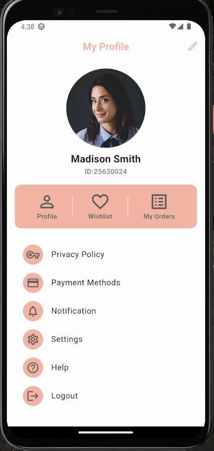
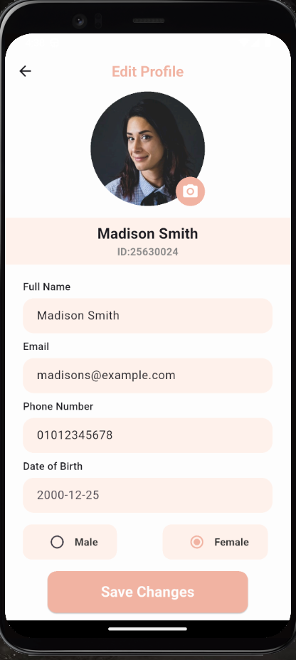
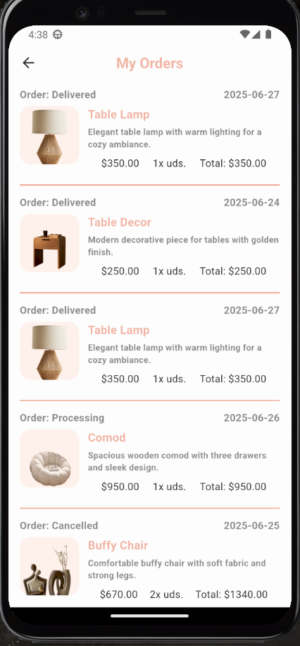

# 👤 User Profile Module - Flutter (GetX + Firebase)

This project is a **User Profile Section** built using **Flutter**, applying **MVVM architecture** and using **GetX** for state management. It demonstrates the ability to structure a clean architecture, integrate with Firebase, and build reusable UI components.

---

## 📱 Screens Implemented

### 1. Profile Screen
- Displays user’s name, email, and profile picture.
- Includes two action buttons:
  - `Edit Profile`
  - `My Orders`

### 2. Edit Profile Screen
- Allows user to:
  - Update their **name**
  - Upload a new **profile image**
- Saves updated data to **Firebase Firestore** and uploads image to **Firebase Storage**.

### 3. My Orders Screen
- Displays a list of **previous user orders** retrieved from **Firebase**.

---

## 🧠 Architecture: MVVM + Clean Architecture

The project follows **MVVM (Model - View - ViewModel)** pattern along with **Clean Architecture** principles:

```bash
lib/
│
├── core/
│ ├── constants/ # Colors, Styles, Sizes
│ ├── widgets/ # Reusable Widgets (Buttons, Fields, etc.)
│
├── data/
│ ├── models/ # UserModel, OrderModel
│ ├── services/ # FirebaseServices
│
├── modules/
│ ├── profile/
│ │ ├── views/
│ │ ├── controllers/
│ │ ├── viewmodels/
│ │ └── bindings/
│ └── orders/
│ ├── views/
│ ├── controllers/
│ └── bindings/
│
└── main.dart
```
---

## 🚀 Tech Stack

- **Flutter**
- **GetX** (Routing, State Management, Bindings)
- **Firebase**:
  - Firestore (User & Orders Data)
  - Firebase Storage (Profile Images)
  - Firebase Auth (for current user info)

---

## 📦 Features

- ✅ Clean UI matching design
- ✅ Firebase integration for data & image upload
- ✅ Reactive GetX Controllers & Bindings
- ✅ Reusable Buttons, TextFields, and AppBars
- ✅ Consistent Theme using centralized constants

---

📸 Screenshot:




